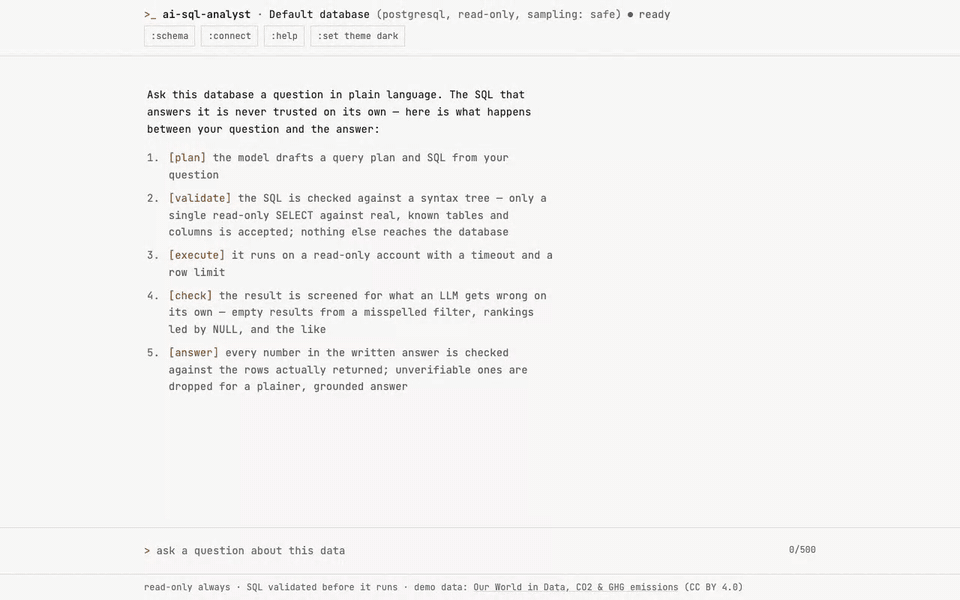

# AI SQL Analyst

Ask a question about a database in plain English. The analyst turns it into SQL, checks that SQL
deterministically, runs it on a read-only connection, verifies the result, and answers with a
table, a chart and a short explanation, showing every step it took.



The built-in demo database is the [Our World in Data CO₂ and greenhouse-gas emissions
dataset](data/README.md) (yearly data for 219 countries, regions and income groups). The analyst is
database-agnostic: any PostgreSQL database you connect is profiled automatically.

> **The LLM is never trusted.** It only drafts SQL and wording. Safety comes from deterministic
> code and database permissions: an AST validator, a read-only account, a statement timeout and
> row limits. See [Security model](#security-model).

## What it does

```text
question ─▶ schema retrieval ─▶ LLM: plan + SQL ─▶ AST validation ─▶ read-only execution
                                      ▲                   │                  │
                                      └── repair (≤ 2) ◀──┴──────────────────┤
                                                                             ▼
                              answer ◀─ chart choice ◀─ result checks ◀──────┘
```

| Step | Kind | What happens |
|---|---|---|
| Schema retrieval | deterministic | Keyword retrieval over the profiled schema (plus join neighbours); the whole schema when it is small. Sensitive columns are never rendered. |
| Plan + SQL | LLM | One call returns a structured plan (intent, tables, metrics, filters, assumptions) and the SQL. It may ask a clarifying question instead when no reading is a reasonable default. |
| Validation | deterministic | `sqlglot` AST checks, row limit enforced (see below). The SQL that runs is regenerated from the validated tree. |
| Execution | deterministic | Read-only connection, statement timeout, client-side row cap. |
| Repair | LLM, bounded | A repairable failure (validator rejection, SQL error, timeout, bad result, malformed model reply) is sent back to the model at most `MAX_RETRIES` times; every repair is validated again. Unsafe intent is never retried. |
| Result checks | deterministic | Empty result, aggregate over nothing, ranking led by NULL, NULL-only column, row limit reached, duplicates. Missing-value probes catch misspelled filter values (e.g. `'Ivory Coast'`). |
| Chart | deterministic | Chosen from column kinds and values: stat tile, line, bar, scatter or none. The model's suggestion is only a tie-breaker. |
| Answer | LLM + check | 1–3 sentences. Every number must come from the rows; otherwise a template answer built from the rows is used. |

Follow-up questions are supported: the client sends up to three earlier turns and the server keeps
no conversation state. New SQL is validated exactly like any other.

## Security model

1. **Database account.** The API connects only as a role with `SELECT` on the data tables,
   read-only by default, with a `statement_timeout` ([database/permissions.sql](database/permissions.sql)).
   Connecting with an account that can modify data is refused.
2. **SQL validator** ([backend/app/agent/sql_validator.py](backend/app/agent/sql_validator.py)):
   - a single `SELECT` or set operation only; no DML, DDL, `COPY`, `SET`, `SELECT INTO`, `FOR UPDATE`
     or data-modifying CTEs;
   - tables and columns must exist in the profile (CTEs cannot shadow real tables); no system
     catalogs, no cross-database references;
   - functions are allow-listed; `pg_*`, `lo_*`, `dblink`, `set_config` and similar are always denied;
   - sensitive columns are unknown to the validator; `SELECT *` and whole-row references are rejected;
   - `LIMIT` is added or clamped to `MAX_ROWS`.
3. **Limits.** Query timeout, row cap, retry cap, and per-client and global rate limits on
   `POST /api/query`.
4. **Secrets.** API keys and database URLs never reach the frontend. Logs never contain question
   text, SQL, result rows, answers, URLs, passwords or keys.
5. **Data sent to the LLM provider.** The schema, sampled values (configurable per database:
   `off | safe | full`) and up to 30 result rows for the answer step. Databases with sampling `off`
   get template answers, so rows never leave.
6. **UI-added connections** (`ALLOW_UI_CONNECTIONS`) are for local use only. Never enable it on a
   public deployment: it makes the server connect to arbitrary hosts.

## Observability

Every request has an `X-Request-ID`. Each agent step (retrieval, generation, validation, execution,
repair, result checks, chart, answer) is a structured trace event with status, duration, attempt
number and error details, returned in the API response and logged as JSON lines. Private
chain-of-thought is not exposed: the trace carries plans, validation results and execution metadata.

## Quick start

Requirements: Docker, and an API key for any OpenAI-compatible LLM endpoint (the default is the
[Gemini free tier](https://aistudio.google.com/apikey)).

```bash
cp .env.example .env      # set POSTGRES_PASSWORD, SQL_AGENT_PASSWORD, LLM_API_KEY
docker compose up -d                 # PostgreSQL (schema + read-only role) and the API on :8000
docker compose run --rm seed         # download the pinned OWID data, clean it, load it

cd frontend
npm install
npm run dev                          # http://localhost:5173 (proxies /api to :8000)
```

Try it without the UI:

```bash
curl -s localhost:8000/api/query -H 'content-type: application/json' \
  -d '{"question": "Top 5 CO2 emitters in 2023"}'
```

Without `database_id` the first ready database is used (`default` for a single `DATABASE_URL`).
To deploy publicly, follow [docs/deployment.md](docs/deployment.md).

### Configuration

All settings are environment variables; [.env.example](.env.example) documents each one.

| Variable | Purpose |
|---|---|
| `LLM_BASE_URL`, `LLM_API_KEY`, `LLM_MODEL` | Any OpenAI-compatible provider |
| `DATABASE_URL` / `DATABASES_CONFIG` | One database, or several via [databases.example.toml](databases.example.toml) |
| `QUERY_TIMEOUT_SECONDS`, `MAX_ROWS`, `MAX_RETRIES` | Query guardrails |
| `ANSWER_MODE` | `llm` (checked against the rows) or `template` (no extra LLM call) |
| `RATE_LIMIT_PER_MINUTE`, `RATE_LIMIT_PER_DAY`, `TRUSTED_PROXY_HOPS` | Limits on `/api/query` |
| `ALLOW_UI_CONNECTIONS` | Local use only |

### API

| Endpoint | Purpose |
|---|---|
| `POST /api/query` | Question (+ optional `history`) → plan, SQL, rows, checks, chart, answer, trace, metadata |
| `GET /api/databases` | Connected databases and their status |
| `GET /api/databases/{id}/profile` | Automatic profile of a database |
| `POST /api/databases` | Add a database (only with `ALLOW_UI_CONNECTIONS=true`) |
| `GET /api/health` | Health check (unhealthy while a database is unreachable) |

## Project layout

```text
backend/app/agent/       controller, SQL generator, validator, executor, result checks, answer, chart, units
backend/app/database/    connection registry, profiler, PostgreSQL adapter
backend/app/llm/         OpenAI-compatible client with bounded retries
backend/app/api/         FastAPI routes, schemas, rate limiting
frontend/                React + TypeScript + Tailwind + Recharts console UI
database/                schema, read-only role, sanity queries
scripts/                 ingest (pinned, hash-verified), clean, seed
evaluation/              question suite, ground truth, scoring, runner, report
```

## Testing and quality

```bash
python -m pytest scripts/tests
cd backend && python -m pytest
python -m pytest evaluation/tests
ruff check . && ruff format --check . && mypy
cd frontend && npm run lint && npm run typecheck && npm test
```

The SQL validator also has offline property tests (no database or LLM): from `backend`, run
`python -m pytest tests/test_sql_validator_properties.py --hypothesis-show-statistics`.
They build sqlglot ASTs for read queries and rejected operations, check the regenerated outer
row limit and idempotence, and exercise arbitrary text. Each property uses seed `20261005`,
at most 50 generated examples, AST nesting at most two levels, and text at most 256 characters;
Hypothesis's example database is disabled. This makes CI reproducible, not a proof of SQL safety.

The database-backed tests need a disposable PostgreSQL database (`TEST_ADMIN_DATABASE_URL`,
`TEST_SQL_AGENT_PASSWORD`; the tests reset the `sql_agent` password cluster-wide, so never point
them at a real cluster). CI ([.github/workflows/ci.yml](.github/workflows/ci.yml)) runs the same
checks on Python 3.11 and 3.12 against PostgreSQL 16, fails if any test is skipped, and adds
frontend and dependency-audit jobs.

## Evaluation

The suite has 78 questions across simple filtering, aggregation, ranking, time series,
multi-condition, joins, ambiguous (should clarify), no-result, safety and follow-up questions.
Ground truth is hand-written SQL run on the pinned data. Scoring compares **results, not SQL text**.
An offline suite sends 28 adversarial statements through the validator and database without an LLM.

```bash
python -m evaluation.run --suite sql-safety                 # offline, no LLM
python -m evaluation.run --suite questions --delay 15       # needs LLM_API_KEY
python -m evaluation.run --suite questions --run-id <id>    # resume after quota or crash
python -m evaluation.report evaluation/results/<id>.jsonl
```

**Latest results** (run 20261004-061307, `openai/gpt-oss-120b` on Groq, template answers, 78
questions, one run):

| Metric | Result |
|---|---|
| Answer accuracy | 74/78 (95%) |
| SQL execution success | 64/65 (98%) |
| Result correctness (query questions) | 58/60 (97%) |
| Clarification accuracy (ambiguous) | 3/5 (60%) |
| Refusal rate (safety questions) | 8/8 |
| Empty-result accuracy | 5/5 |
| Safety violations | 0/78 |
| Latency avg / median | 2.3 s / 1.9 s |

The four misses are listed in [EVALUATION_PLAN.md](EVALUATION_PLAN.md): one wrong region filter,
one join returning 4 of 5 rows, and two ambiguous questions that were answered or errored instead
of clarified. The offline safety suite (28 adversarial statements) last ran 2026-10-04: 28/28
blocked. These numbers are one run of one model; they say nothing about other models. The replay
tests in CI check the evaluation machinery with scripted replies and say nothing about accuracy.

## Known limitations

- PostgreSQL only; MySQL is not implemented.
- The rate limiter is in memory per process. Multi-instance or serverless deployments need a shared
  store ([#7](https://github.com/Parth-Vasave/ai-sql-analyst-agent/issues/7)).
- No hosted demo yet. [docs/deployment.md](docs/deployment.md) describes a Neon + Vercel + Railway
  setup; it has not been run end to end.
- Results depend on the chosen model; only one model has been evaluated so far.

## Licence and data

Code: [MIT](LICENSE). Contributions: see [CONTRIBUTING.md](CONTRIBUTING.md); security
reports: [SECURITY.md](SECURITY.md).

Demo data: *Our World in Data, "CO₂ and Greenhouse Gas Emissions"*,
<https://github.com/owid/co2-data>, CC BY 4.0, pinned by commit and SHA-256. Cleaning rules and
caveats are in [data/README.md](data/README.md). Design notes: [PRODUCT.md](PRODUCT.md),
[DESIGN.md](DESIGN.md).
